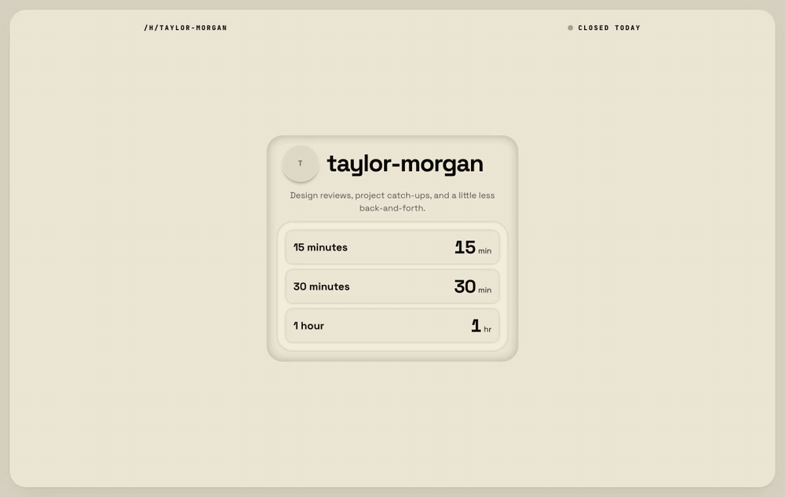

# TimeHalo

**Set your hours. Share your link. Let people choose a time.**

TimeHalo is a scheduling app for one-on-one meetings. Hosts manage their availability and bookings; visitors pick a meeting length, date, and time from a public booking page. It also supports team workspaces and shared event types.

[Try the hosted app](https://timehalo.app) · [Run locally](#run-locally) · [Self-hosting guide](docs/SELF_HOSTING.md) · [Report an issue](https://github.com/safuentees/timehalo/issues)

## See it in action



*A short recording of the real app running locally with fictional sample data. The loop shows meeting selection, the calendar, and the booking form.* [View the still image](docs/media/booking-preview.png).

## What you can do

| For hosts | For visitors |
| --- | --- |
| Set weekly availability and a booking horizon | See available times in their own timezone |
| Share a personal page at `/h/your-handle` | Choose a meeting length, date, and time |
| Manage upcoming and past bookings | Book, cancel, or reschedule a meeting |
| Connect Google Calendar or Microsoft Outlook | Add a confirmed meeting to their calendar |
| Create team workspaces and event types | Book through a personal page or embedded widget |

Other features include email confirmations and reminder workflows, round-robin host assignment, light and dark themes, and English and Spanish translations. Calendar sync, email delivery, and paid plans require the corresponding services to be configured.

### The booking flow

1. **Host:** choose a handle, set your hours, and share `https://your-domain/h/your-handle`.
2. **Visitor:** open the link, choose a duration, and pick an available time.
3. **Visitor:** enter a name and email address, then confirm the booking.
4. **Host:** manage the meeting from the bookings dashboard. Visitors can use their confirmation link to cancel or reschedule.

## Run locally

You can try the app with a local SQLite file. A Turso account, Stripe account, and calendar credentials are optional for this first run.

### 1. Install the project

Use **Node.js 24** (the version in [`.nvmrc`](.nvmrc) and CI) and **pnpm 9.15.9** (pinned in [`package.json`](package.json)).

```bash
git clone https://github.com/safuentees/timehalo.git
cd timehalo
pnpm install --frozen-lockfile
cp .env.example .env
```

### 2. Configure `.env`

Keep the local database URL and set these values:

```dotenv
DATABASE_URL="file:./dev.db"
AUTH_SECRET="replace-with-a-generated-secret"
AUTH_URL="http://localhost:3001"
NEXT_PUBLIC_APP_URL="http://localhost:3001"
```

Generate your own `AUTH_SECRET` with `openssl rand -base64 32` and paste the output into `.env`. The `AUTH_URL` makes local sign-in redirects use HTTP on the correct port. `.env` is ignored by Git.

Use **`.env`**, since both Next.js and the Prisma configuration load it. Copying the template only to `.env.local` leaves the Prisma CLI without these values.

### 3. Create the database and start the app

```bash
pnpm prisma generate

# Ensure the SQLite file exists before applying the migrations.
node -e "const fs = require('node:fs'); fs.closeSync(fs.openSync('dev.db', 'a'))"

pnpm prisma migrate deploy
pnpm dev
```

Open **[http://localhost:3001](http://localhost:3001)** and choose **Try as a guest**. This creates an individual demo account with default availability and a personal workspace, so you can explore without configuring email or signing up.

If your browser upgrades local links to HTTPS and reports `ERR_SSL_PROTOCOL_ERROR`, follow the [local HTTPS instructions](docs/SELF_HOSTING.md#local-https).

To create a regular account, configure Resend first: registration sends an email verification code. Without an email provider, delivery-dependent flows such as verification and magic-link sign-in cannot complete.

> `pnpm setup` is an optional bootstrap helper for clones and worktrees; it installs dependencies, generates Prisma, applies migrations, and configures Git hooks. It does not seed example users. The seed script also does not create sample accounts.

## Configuration

The complete list, with provider setup notes, is in [`.env.example`](.env.example). Only `DATABASE_URL` and `AUTH_SECRET` are required by the app's environment validator; set the local URLs shown above for development.

| Service | Environment variables | Enables |
| --- | --- | --- |
| Turso | `DATABASE_URL`, `TURSO_AUTH_TOKEN` | Hosted libSQL database; no token needed for a local `file:` URL |
| Resend | `RESEND_API_KEY`, `EMAIL_FROM` | Account verification, magic links, and booking emails |
| Background worker | `CRON_SECRET` | Authenticated processing of queued emails, reminders, and webhook tasks |
| GitHub OAuth | `AUTH_GITHUB_ID`, `AUTH_GITHUB_SECRET` | GitHub sign-in |
| Google Calendar | `GOOGLE_OAUTH_CLIENT_ID`, `GOOGLE_OAUTH_CLIENT_SECRET`, `CALENDAR_TOKEN_KEY` | Calendar connection and busy-time checks |
| Microsoft Outlook | `MICROSOFT_OAUTH_CLIENT_ID`, `MICROSOFT_OAUTH_CLIENT_SECRET`, `CALENDAR_TOKEN_KEY` | Calendar connection and busy-time checks |
| Stripe | `STRIPE_SECRET_KEY`, `STRIPE_PRICE_PRO`, `STRIPE_PRICE_TEAM`, `STRIPE_WEBHOOK_SECRET` | Billing and paid plans |
| Upstash Redis | `UPSTASH_REDIS_REST_URL`, `UPSTASH_REDIS_REST_TOKEN` | Shared rate limiting; otherwise the app uses an in-memory limiter |
| Sentry | `NEXT_PUBLIC_SENTRY_DSN` | Error reporting and tracing |

For local task processing, set `CRON_SECRET` and run `pnpm dev:cron` in a second terminal. Configure Resend before processing email tasks: without its API key, those tasks are logged and marked as skipped.

## Built with

| Layer | Technology |
| --- | --- |
| App and UI | Next.js 16 App Router, React 19, TypeScript, Tailwind CSS 4, Base UI |
| Animation | Motion and GSAP |
| API and server state | tRPC 11 and TanStack Query 5 |
| Data | Prisma 7, SQLite locally, Turso/libSQL for hosted deployment |
| Authentication | Auth.js 5 beta |
| Integrations | Resend + React Email, Google Calendar, Microsoft Outlook, Stripe |
| Operations | Upstash Redis, Sentry, GitHub Actions, Vercel |

The backend includes idempotent booking requests, conflict checks, audit logs, signed webhooks with retries, API keys, soft deletion, and a live booking queue using server-sent events. API documentation is served at `/api/v1/docs`, with the OpenAPI specification at `/api/openapi.json`.

## Development

| Command | Purpose |
| --- | --- |
| `pnpm dev` | Start the app on port 3001 |
| `pnpm dev:cron` | Process local background tasks |
| `pnpm email:preview` | Preview React Email templates on port 3002 |
| `pnpm lint` | Run ESLint |
| `pnpm exec tsc --noEmit` | Check TypeScript |
| `pnpm test:run` | Run the Vitest suite once |
| `pnpm exec playwright test` | Run browser tests |
| `pnpm build` | Build for production |
| `pnpm start` | Serve the production build |

Before the first browser test run, install Chromium with `pnpm exec playwright install chromium`. Playwright starts the app on port 3001 and prepares its test account. Use a separate test database, since the global setup modifies fixtures. CI runs lint, type checking, Vitest, and Playwright; see the [workflow](.github/workflows/ci.yml) and [testing conventions](.claude/rules/testing.md).

```text
src/app/               Routes: host dashboard, public booking pages, APIs
src/components/oh/     Shared application chrome and forms
src/components/ui/     UI primitives
src/trpc/              Typed API routers and procedures
src/lib/               Scheduling, integrations, and background task logic
prisma/                Database schema and migration history
e2e/                   Browser tests and fixtures
test/                  Vitest tests and fixtures
```

For production deployment, migrations, cron configuration, and backups, see the **[self-hosting guide](docs/SELF_HOSTING.md)**. The `dev:full` script uses the maintainer's Stripe and Cloudflare tunnel defaults; that guide explains what to configure before using it.

## Contributing and support

Read [`AGENTS.md`](AGENTS.md) and any instructions scoped to the files you change. Run the relevant checks above, and update [`BACKLOG.md`](BACKLOG.md) when shipping or deferring a tracked item. The backlog is the source of truth for shipped features and planned work.

Use [GitHub Issues](https://github.com/safuentees/timehalo/issues) for bugs and feature requests. Include steps to reproduce and the relevant error message; keep credentials and personal booking data out of reports. Maintained by [safuentees](https://github.com/safuentees).

## License

TimeHalo is **source-available** under the [Business Source License 1.1](LICENSE), with an additional grant for non-commercial use, including personal use, internal evaluation, development, and testing. Commercial use requires a separate license from the licensor. The license specifies **2030-05-12** as its change date and **Apache 2.0** as its change license. See [LICENSE](LICENSE) for the full terms.

## Acknowledgments

Inspired by [Cal.com](https://github.com/calcom/cal.com) and [Dub](https://github.com/dubinc/dub). This README follows [GitHub's official README guidance](https://docs.github.com/en/repositories/managing-your-repositorys-settings-and-features/customizing-your-repository/about-readmes), with structure informed by the community [Best-README-Template](https://github.com/othneildrew/Best-README-Template).
